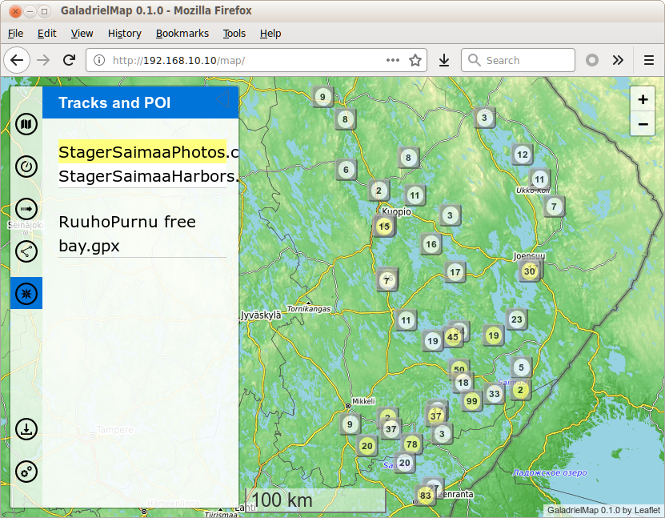

# Finland Saimaa lake POI [](https://creativecommons.org/licenses/by-sa/4.0/)
Saimaa marinas and nature harbors list.<br>
From different sources, mostly from "Saimaan Venematkailuopas" and Fonecta map (RIP). And a bit on personal impressions.<br>
Also - my own beautiful views and informative GoodlePhotos.
 
 
 All of this point are public, as I think.

You may view this files "as is" in any map app, able to obtain POI in csv format. [GaladrielMap](https://github.com/VladimirKalachikhin/Galadriel-map/tree/master) is a good choice.<br>
Or you may convert it to a preferred format by *gpsbabel*.<br>
To gpx, for example:
```
gpsbabel -i unicsv -f StagerSaimaaPhotos.csv -o gpx -F StagerSaimaaPhotos.gpx
```

